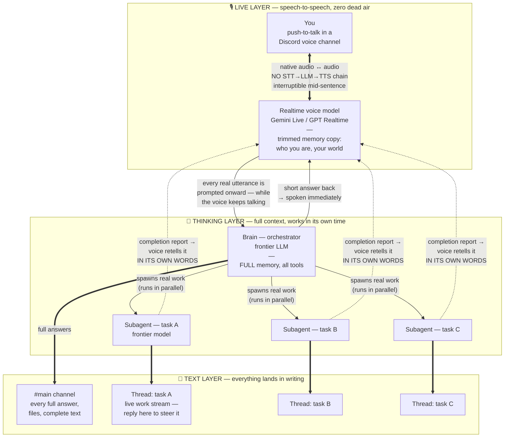

# True Jarvis - a voice agent with zero dead air, zero response delays and a frontier-LLM brain

**No delays. No awkward silences. No waiting while "it thinks." A live spoken assistant that answers the instant you stop talking, while real work runs in parallel on the most advanced models available.**

That combination is supposed to be impossible. Realtime voice models answer instantly but are shallow; frontier reasoning models are brilliant but take seconds to start talking, and seconds of dead air kill a spoken conversation. Every voice assistant you've tried picked one side of that trade-off.

This build refuses the trade-off. You talk over Discord push-to-talk, from any device. Ask something simple - instant answer, natural voice, like a person on a call. Give it a real task - it says *"on it"*, keeps chatting with you, and tells you - in its own words, out loud, when the task is done. It feels like one continuous mind. Under the hood it's **three layers glued into a single persona**, and this repo is the blueprint for the glue.

**Framework-agnostic on purpose.** What follows is a wiring pattern, not a product. It needs an agent app that gives you a live voice channel, a text channel, subagents that run in parallel, and a memory. [OpenClaw](https://openclaw.ai), [Hermes Agent](https://github.com/NousResearch/hermes-agent) and comparable agent apps all expose those primitives. My build ran on OpenClaw, so the configuration below is written in OpenClaw's dialect: translate the key names, keep the shape. Bring your own API keys, your own tools, and your own name for it (mine is called Isaac, after Asimov).

> **There is a version 2 of this idea: [true-jarvis-2.0](https://github.com/magomed-esendirov/true-jarvis-2.0).**
> In *this* version the voice decides what counts as a task and forwards it to the brain, which is the single most fragile part of the design (see [Hard-won lessons](#hard-won-lessons)). In 2.0 the brain reads a mirror of the whole conversation and makes that call itself, so nothing can be silently dropped. Same three layers, one wire moved. Read this one first: it is the simpler build, and it is what 2.0 is fixing.

---

## The core idea: speech-to-speech, with everything else living its own life

The voice layer is a **native speech-to-speech model** — not a speech-to-text → LLM → text-to-speech chain. Audio goes in, audio comes out of one realtime model. That is what makes the conversation feel alive: it hears you *while you speak*, you can interrupt it mid-sentence, and there is no pipeline of transcription → thinking → synthesis to wait through.

Everything else — text, tasks, memory — deliberately lives a separate life:

- **The voice answers short and instantly.** Always. Even when the real answer will take minutes.
- **The full answer lands in text.** Every substantive result is written to a Discord channel — complete, formatted, permanent.
- **Tasks run in parallel, each in its own thread.** You can watch any of them work, and steer them by replying in the thread.
- **When a task finishes, the voice tells you** — a short spoken summary in its own words, not a canned "done".

You keep a live human-paced conversation the whole time. The heavy machinery never makes you wait.

## Three layers, one persona

| Layer | Model | Job |
|---|---|---|
| **The face** | A realtime speech-to-speech model — Gemini Live (`gemini-3.1-flash-live-preview`) or OpenAI GPT Realtime, both slot in | Hears you, speaks, handles small talk, never goes silent. Carries a **trimmed copy of the memory** — who you are, your world, your preferences — so even instant answers are personal |
| **The brain** | Any frontier LLM (I run Grok 4.5) | The orchestrator. Holds the **full memory** and all the tools. Answers quick questions inline; anything that is real *work* it spawns off to a subagent — then keeps orchestrating |
| **The hands** | Subagents on a frontier model (I run Claude Opus 5, thinking high) | One subagent per task, many in parallel. Each works in its own session and streams into its own Discord thread |

The voice model treats the brain as *its own deeper mind*, through whatever "ask the agent" tool your framework exposes — in OpenClaw it is `openclaw_agent_consult`, every comparable app has an equivalent — and is explicitly instructed to never mention backends. The user never meets three agents — there is only one character.

## How a turn flows

```
You:    "You there?"
Agent:  "Yep, here."                             ← voice answers itself, ~0 latency
                                                    (its trimmed memory makes even this personal)

You:    "Go through yesterday's court emails and draft replies."
Agent:  "On it."                                 ← instant spoken ack — AND the utterance
                                                    is simultaneously prompted to the brain
        (the brain spawns the task into a subagent; a Discord thread appears
         where the work streams live; you keep chatting with the voice meanwhile)

Agent:  "Done — three emails, two need your      ← when the subagent finishes, the voice
         signature, drafts are in the thread."      reports the OUTCOME in its own words
```

- **Simple** → the voice answers directly. Perceived latency: none.
- **Substantive** → instant spoken ack; the brain answers from full memory and tools; result spoken *and* written.
- **Real work** → the brain spawns a subagent; the task gets its own thread; the voice narrates the completion when it lands. Several tasks run at once, none of them ever blocks the conversation.

## Architecture



Three lifecycles, decoupled on purpose: the **conversation** is realtime and never blocks; the **work** takes as long as it takes, in parallel threads; the **text** is the permanent record of both. The bridges between them are what this repo is really about.

## The bridges (what actually glues it together)

1. **Voice → brain: async prompt, not a blocking call.** The voice acknowledges you out loud and *simultaneously* forwards the utterance to the brain. The conversation never waits on the thinking.
2. **Brain → subagents: work is spawned, never done inline.** Anything that means *doing* — finding, writing, signing, sending — becomes a subagent with its own session and its own Discord thread. The brain stays free to keep orchestrating (and answering you).
3. **Sessions → text: a mirror pipeline.** A small bridge tails the session logs and posts every final answer to the channel and every subagent's work into its thread. Delivery is infrastructure, not a prompt instruction — pipelines are guarantees.
4. **Task completion → voice: a report queue.** When a subagent finishes, its result is queued for the voice layer, which announces it as a *natural spoken summary in its own words* — the same voice, the same persona, closing the loop that started with your spoken request.
5. **Memory, two sizes.** The brain owns the full memory (workspace files, long-term notes). A trimmed bootstrap copy is injected into the voice session — small enough for a realtime model, rich enough that "how's my daughter's paperwork going?" gets an instant, personal answer.

## Configuration (the parts that matter)

Written in OpenClaw's config dialect, key names as of 2026.7.1. Fragments, not a full config — adapt to your setup. On another agent app the names change and the four decisions do not: which model orchestrates, how many subagents may run at once, which model they run on, and that the voice is told to forward real questions instead of answering them itself.

```jsonc
{
  "agents": {
    "defaults": {
      "model": "xai/grok-4.5",             // the brain-orchestrator — any frontier model
      "thinkingDefault": "high",
      "subagents": {
        "maxConcurrent": 10,               // parallel tasks
        "model": {
          "primary": "anthropic/claude-opus-5",  // the hands — strongest model you can afford
          "fallbacks": []                  // fail visibly, never degrade silently
        }
      }
    }
  },
  "channels": {
    "discord": {
      "voice": {
        "mode": "bidi",                    // full-duplex: interruptible, never blocks
        "realtime": {
          "consultPolicy": "always",       // voice must forward real questions to the brain
          "providers": {
            "google": {
              "model": "gemini-3.1-flash-live-preview",
              "voice": "Enceladus",
              "languageCode": "ru-RU",     // any language Gemini Live supports
              "temperature": 0.2           // lower temp → more reliable tool-calling
            }
            // or swap the provider block for OpenAI GPT Realtime — same pattern
          }
        }
      }
    }
  }
}
```

### The voice instructions (the actual glue)

The single most important piece of prompt engineering in the system. The failure mode of `bidi` mode is that the voice model *answers from its own weights* instead of consulting the brain — and, counterintuitively, **short commands are the most likely to be swallowed** (in my logs: utterances under 5 s were delegated 14% of the time; over 20 s — 92%). The instructions attack exactly that:

```text
You are <NAME>, live in a Discord voice channel with your operator. You are one
persona with the full agent; the consult tool is your own deeper mind with memory
and tools — never mention backends. Tone: calm competent colleague.

CRITICAL — SHORT COMMANDS ARE STILL COMMANDS. Your biggest failure is treating a
short utterance as small talk and answering it yourself. Length means NOTHING —
a 2-second phrase can be a real task ("do it", "send it", "check the second one",
"go on"). Follow-ups in the middle of a task are the MOST important turns to
delegate — the operator is steering real work.

RULE: if the utterance refers to ANY action, file, message, email, person, case,
document, or continues a previous task — consult, with a complete self-contained
question (include what you were doing; your deeper mind may lack that context).
Answer yourself ONLY for pure greetings and acknowledgements.

When in doubt — CONSULT. A needless consult costs nothing; a dropped task means
the operator asked and nothing happened, the worst outcome.

Never leave silence: say a short phrase like "on it, sec" before consulting, keep
chatting while it runs, then state the result once, briefly, accurately. Never
claim something is done unless the consult result says so.
```

## Hard-won lessons

Things that cost me days, so they cost you nothing:

- **Delegation is probabilistic, not guaranteed.** `consultPolicy: "always"` is prompt-level — the realtime model can still decide your command was chit-chat. Targeted instructions (above) + low temperature raise the rate substantially. For the rest, build deterministic safety nets *outside* the model: classify utterances in code, wrap real tasks with explicit spawn instructions, and add a dispatcher that rescues utterances the voice failed to forward. **This is the lesson that produced [true-jarvis-2.0](https://github.com/magomed-esendirov/true-jarvis-2.0):** past a certain point the cleaner answer is to stop asking the voice to decide at all — mirror the entire conversation to the brain as text and let the strongest model in the stack judge what is work. That is a change of wiring, not of framework: the mirror is just as buildable on OpenClaw as this dispatcher is on Hermes Agent.
- **One task = one thread = one subagent.** Piling work into the main conversation makes everything invisible and sequential. Spawning every real task gives you parallelism, a live view of each job, and per-task steering for free.
- **Speaking is not delivery.** If a task outlives the voice session, the spoken result evaporates. Every result must also land as text, unconditionally — and completion reports must be re-queued if the user talked over them.
- **Voice sessions degrade quietly.** Realtime sessions get killed and resumed constantly; after enough churn a session can go half-deaf or near-mute while looking healthy in the logs. Detect "user spoke, nothing answered" patterns and recreate the session fresh rather than debugging a haunted one.
- **One brain, many mouths — sessions split by default.** If voice and the text channel are separate sessions, you get agents with separate memories wearing the same name. Unify them deliberately.
- **Windows specifics** (if you run it there natively): run the gateway as a Scheduled Task with battery-friendly settings; stopping a task does NOT kill its child process — kill by command line before restarting, or you'll run two copies; npm global installs from sandboxed contexts can land in an MSIX overlay the real system can't see; always use forward slashes in paths you pass to exec tools.

## What is NOT in this repo

By design — this is the voice+brain+subagents pattern, not my personal assistant:

- No memory system (your agent app has one — OpenClaw and Hermes Agent both do; configure to taste)
- No personal tools (email, documents, messengers, calendars — add your own as skills)
- No API keys, tokens, or configs with real IDs

Take the pattern, give it your own name, your own voice, and your own hands.

## Credits

- The agent framework doing the heavy lifting: channels, sessions, the consult mechanism, subagents, tool plumbing. This build ran on [OpenClaw](https://openclaw.ai); [Hermes Agent](https://github.com/NousResearch/hermes-agent) and other agent apps expose the same primitives
- Google **Gemini Live** / OpenAI **GPT Realtime** — the speech-to-speech face
- xAI **Grok 4.5** — the orchestrator brain in my setup (fully swappable)
- Anthropic **Claude Opus 5** — the hands doing the actual work
- [true-jarvis-2.0](https://github.com/magomed-esendirov/true-jarvis-2.0) — the next iteration, with the "is this a task?" decision moved out of the voice and into the brain

## License

MIT
